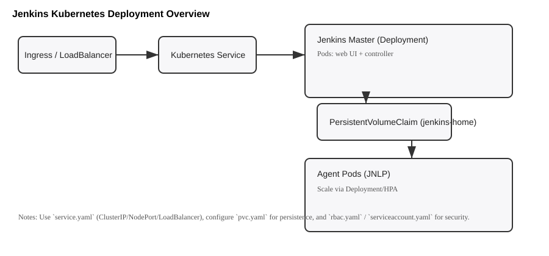

# Jenkins Kubernetes Deployment

This repository contains Kubernetes manifests and helper scripts to deploy Jenkins on a Kubernetes cluster.



## Overview
- **Manifests & scripts:** Kubernetes YAMLs and helper scripts for installing and configuring Jenkins on a cluster.
- **Key files:**
  - `deployment.yaml` — Jenkins Deployment spec
  - `service.yaml` — Services (web UI, JNLP)
  - `pvc.yaml` — PersistentVolumeClaim for Jenkins data
  - `configmap.yaml` — Custom config and templates
  - `secret.yaml` — Secrets for admin credentials (update values before applying)
  - `rbac.yaml`, `serviceaccount.yaml` — RBAC and service account resources
  - `ingress.yaml` — Ingress rules (optional)
  - `tls-secret.yaml` — TLS secret for jenkins-tls (previously created imperatively)
  - `argocd-app.yaml` — ArgoCD Application manifest (new)
  - `setup_jenkins.sh` — Convenience install script (manual/kubectl workflow)
  - `remove_jenkins.sh` — Cleanup script

---

## 🚀 Deploy with ArgoCD (Recommended)

### Prerequisites
- ArgoCD installed in your cluster (`argocd` namespace)
- This repository pushed to a Git remote (GitHub, GitLab, etc.)

### Step 1 — Update the repo URL in argocd-app.yaml

Edit `argocd-app.yaml` and replace the placeholder:
```yaml
repoURL: https://github.com/YOUR_ORG/YOUR_REPO.git
```

### Step 2 — Apply the ArgoCD Application

```bash
kubectl apply -f argocd-app.yaml
```

ArgoCD will automatically sync all manifests from this directory in the correct order (controlled by `argocd.argoproj.io/sync-wave` annotations).

### Sync order (sync-waves)

| Wave | Files | Purpose |
|------|-------|---------|
| -3 | `podsecurity.yaml` | Namespace + pod security labels |
| -2 | `serviceaccount.yaml` | Jenkins ServiceAccount |
| -1 | `jenkins-sa-token.yaml` | SA token secret |
|  0 | `rbac.yaml`, `jenkins-admin-binding.yaml`, `allow-anonymous.yaml` | RBAC |
|  1 | `secret.yaml`, `tls-secret.yaml`, `configmap.yaml`, `jenkins-proxy-headers.yaml`, `pvc.yaml` | Config & storage |
|  2 | `deployment.yaml` | Jenkins pod |
|  3 | `service.yaml`, `jenkins-jnlp-service.yaml`, `jenkins-allow-all.yaml` | Services & network |
|  4 | `ingress.yaml`, `hpa.yaml`, `network.yaml` | Ingress, autoscaling, egress policies |

### Step 3 — Monitor sync

```bash
# Watch the Application status
argocd app get jenkins

# Watch sync progress
argocd app sync jenkins --watch

# Or via kubectl
kubectl get pods -n jenkins -w
```

### Updating Jenkins (GitOps workflow)
1. Edit any manifest (e.g. bump the image tag in `deployment.yaml`)
2. `git commit` and `git push`
3. ArgoCD detects the change and automatically syncs (auto-sync is enabled with `prune: true` and `selfHeal: true`)

---

## Quick install (manual kubectl)

1. Ensure you have a Kubernetes cluster and `kubectl` configured.
2. Review and customize secrets and PVC settings in `secret.yaml` and `pvc.yaml`.
3. Apply manifests in order:

```bash
kubectl apply -f podsecurity.yaml
kubectl apply -f serviceaccount.yaml
kubectl apply -f jenkins-sa-token.yaml
kubectl apply -f rbac.yaml
kubectl apply -f jenkins-admin-binding.yaml
kubectl apply -f allow-anonymous.yaml
kubectl apply -f secret.yaml
kubectl apply -f tls-secret.yaml
kubectl apply -f configmap.yaml
kubectl apply -f jenkins-proxy-headers.yaml
kubectl apply -f pvc.yaml
kubectl apply -f deployment.yaml
kubectl apply -f service.yaml
kubectl apply -f jenkins-jnlp-service.yaml
kubectl apply -f jenkins-allow-all.yaml
kubectl apply -f ingress.yaml
kubectl apply -f hpa.yaml
kubectl apply -f network.yaml
```

Alternatively run the provided script:

```bash
./setup_jenkins.sh
```

---

## Notes
- `tls-secret.yaml` — This file replaces the imperative `kubectl create secret tls jenkins-tls --key tls.key --cert tls.crt` command previously run by `setup_jenkins.sh`. ArgoCD manages it declaratively now.
- Check `custom_template.html` and `jenkins-proxy-headers.yaml` for custom UI and proxy headers.
- Adjust `hpa.yaml` if you want autoscaling configured.
- For metrics and monitoring, see `install-metrics-server.sh`.

## Prerequisites
- `kubectl` configured to talk to your target cluster
- A storage class available for the `PersistentVolumeClaim`
- Permissions to create RBAC, ServiceAccount, Secrets, and Namespaces

## Verify deployment
- Check pods: `kubectl get pods -n jenkins`
- Check services: `kubectl get svc -n jenkins`
- Tail Jenkins logs: `kubectl -n jenkins logs -l app=jenkins --follow`
- ArgoCD app status: `argocd app get jenkins`

## Repository files (expanded descriptions)

- `argocd-app.yaml` — ArgoCD Application CR. Points ArgoCD at this repo+path and configures automated sync with pruning and self-heal. Apply this once to bootstrap the entire stack. Update `repoURL` and `targetRevision` before applying.

- `jenkins-ns.json` — Namespace manifest (JSON). Use to create the `jenkins` namespace as an alternative to `kubectl create namespace jenkins`.

- `serviceaccount.yaml` — Defines the `jenkins` `ServiceAccount` in the `jenkins` namespace. The account is referenced by the `Deployment` (`serviceAccountName: jenkins`).

- `rbac.yaml` — Namespace-scoped `Role` and `RoleBinding` granting Jenkins permissions such as `pods`, `pods/log`, `services`, `persistentvolumeclaims`, and `secrets`. Apply this to allow Jenkins to manage resources in its namespace.

- `jenkins-sa-token.yaml` — A Secret of type `kubernetes.io/service-account-token` bound to the `jenkins` `ServiceAccount`. The token is extracted by `setup_jenkins.sh` and is intended for use by Jenkins' Kubernetes Cloud credentials.

- `jenkins-admin-binding.yaml` — Optional RBAC binding that grants admin privileges to a user or group; review before applying in production.

- `secret.yaml` — Contains base64-encoded admin credentials used by the container. Example values in the repo are placeholders (base64 for `admin` / `admin123`) — replace them with secure values before use.

- `tls-secret.yaml` — TLS Secret (`kubernetes.io/tls`) for the `jenkins-tls` ingress secret. Previously created imperatively by `setup_jenkins.sh`; now declared as a YAML manifest so ArgoCD can track and manage it.

- `pvc.yaml` — Defines a hostPath `PersistentVolume` (`/var/jenkins_home`) and a matching `PersistentVolumeClaim` named `mypvc`. This PVC is mounted as `jenkins-home` in the `Deployment`. For cloud clusters, change to a storage-class backed PV/PVC.

- `deployment.yaml` — Jenkins `Deployment` (image: `daggu1997/jenkins-docker-k8s:v1.0.2`) with resource requests/limits, JVM options, and probes. Important details:
  - Probes: `startupProbe`, `readinessProbe` target `/login` to accommodate plugin initialization.
  - Environment variables: `JENKINS_ADMIN_USER`, `JENKINS_ADMIN_PASSWORD` (from `jenkins-admin-secret`), and `JENKINS_URL`.
  - Volume mounts: `jenkins-home` (PVC `mypvc`).

- `service.yaml` — ClusterIP `Service` exposing ports `8080` (HTTP), `50000` (agent/JNLP), and `8443` (HTTPS). Use `NodePort`/`LoadBalancer` if exposing externally, or use `ingress.yaml`.

- `jenkins-jnlp-service.yaml` — Separate ClusterIP `Service` that exposes only the JNLP/agent port (`50000`). Useful when you want to isolate agent traffic.

- `configmap.yaml` — Basic `ConfigMap` (provides `JENKINS_HOME` in this repo).

- `jenkins-proxy-headers.yaml` — ConfigMap providing `X-Forwarded-*` headers for the ingress controller.

- `ingress.yaml` — Example `Ingress` (NGINX) configured for host `jenkins.raja.com`, TLS via `jenkins-tls`, and annotations to force SSL and use forwarded headers. Update `host` and `secretName` to match your environment.

- `hpa.yaml` — `HorizontalPodAutoscaler` (autoscaling/v2) targeting the `jenkins` Deployment with CPU utilization target (example: 90%). Requires `metrics-server` to be installed for metrics visibility.

- `network.yaml` — `NetworkPolicy` allowing DNS and internet egress for all pods in the namespace.

- `podsecurity.yaml` — Namespace with PodSecurity labels ensuring pods run with `privileged` policy.

- `allow-anonymous.yaml` / `jenkins-allow-all.yaml` — Example permissive configurations. These are convenience/demo files; do not use in production without an audit.

- `install-metrics-server.sh` — Installs the upstream `metrics-server` and patches it to allow `--kubelet-insecure-tls`.

- `check_jenkins_status.sh` — Lightweight script that lists pods, secrets, PV/PVCs, and namespace resources for quick checks.

- `check_jenkins_full_status.sh` — Extended diagnostics: lists resources, shows `kubectl top` metrics, and tails recent Jenkins pod logs.

- `setup_jenkins.sh` — Manual installer script for kubectl-based deployments (non-ArgoCD).

- `remove_jenkins.sh` — Helper to delete the deployed resources from the cluster.

- TLS files: `cert`, `tls.crt`, `tls.key`, `fullchain.pem`, `privkey.pem` — Source TLS files. `tls.crt` and `tls.key` are base64-encoded in `tls-secret.yaml`.

- `patch_work` and `pod_templete` — Local notes for patches and pod template reference.

## Security notes
- Review all `yaml` files and replace placeholder secrets before applying to production clusters.
- Do not expose admin credentials or permissive RBAC in public clusters.

---
Created diagram: assets/jenkins-diagram.svg
